# AWS Workbench Properties Editor

The properties editor define the characteristics of the AWS Service. 

For example a stack defined by properties as below 
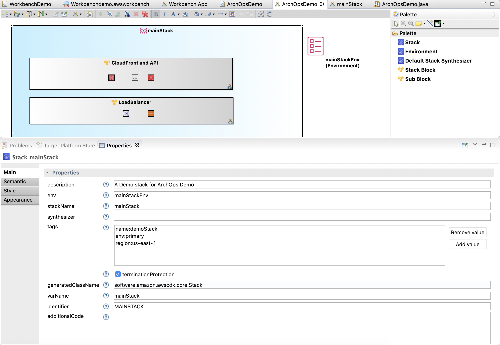

would generate the following code. 

```java
java.util.Map<java.lang.String, java.lang.String> mainStack_tags = new java.util.HashMap<java.lang.String, java.lang.String>();

		mainStack_tags.put("name", "demoStack");
		mainStack_tags.put("env", "primary");
		mainStack_tags.put("region", "us-east-1");

		mainStack = software.amazon.awscdk.core.Stack.Builder.create(app1, "MAINSTACK")
				.description("A Demo stack for ArchOps Demo").env(mainStackEnv).stackName("mainStack")
				.tags(mainStack_tags).terminationProtection(true).build();

```

***Understanding properties editor is critical to use this tool effectively.***


Properties of AWS Services are modelled based on [Builder pattern](https://en.wikipedia.org/wiki/Builder_pattern) . 

For example this is the [Builder](https://docs.aws.amazon.com/cdk/api/latest/java/software/amazon/awscdk/core/Stack.Builder.html) for ```Stack```. The names of the methods in the Builder become the property names in the Property editor. 


## Mandatory properties 

- For ***App*** object, ```projectName```, ```packageName```, ```mainClassName```, ```varName``` and ```identifier``` are mandatory properties.
- For ***Block*** and ***Sub Block***, ```label``` is mandatory. *Block* has one more property called ```canDeploy```. Until the value of **canDeploy** is ```true```, Block content is in *draft* state and the corresponding code ***will not be exported***. Neither the elements from the Block can be referenced in other blocks. 
- For ***Stack*** and all other ***AWS Service Components***, ```varName``` and ```identifier``` are mandatory properties.

## Property types
- Properties can be of type ```String```, ```Number```,```Boolean```,```Enum```,```Reference```,```List``` and ```Map``` 
- To know the expected value for the property, hover on the ```?``` next to the property name. The information is available as a tooltip on the ```?``` symbol. When the expected value is a ```Reference``` , the complete class name is displayed in the tooltip. More information on the class is available at [AWS CDK Javadocs](https://docs.aws.amazon.com/cdk/api/latest/java/index.html)

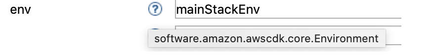

  
- For ```String```, ```Number``` and ```Reference```, a **Textbox** is provided to enter the values

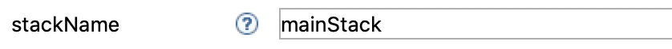
  

- A ```Boolean``` is represented by **Checkbox**  . 


   

- ```Enum``` are represented by **Radio Buttons**

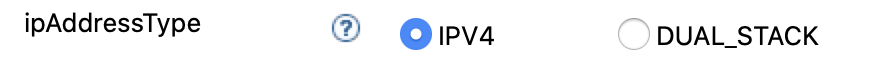

  
- For ```List``` and ```Map``` , a **List Box** is provided.

    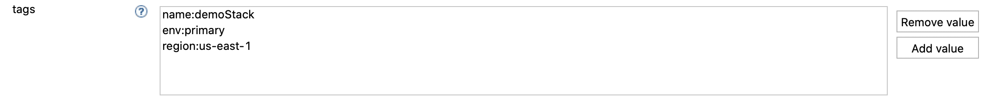

Clicking ```Add value``` button pops up a dialog box prompting to enter the list or map value 

List Item Dialog:

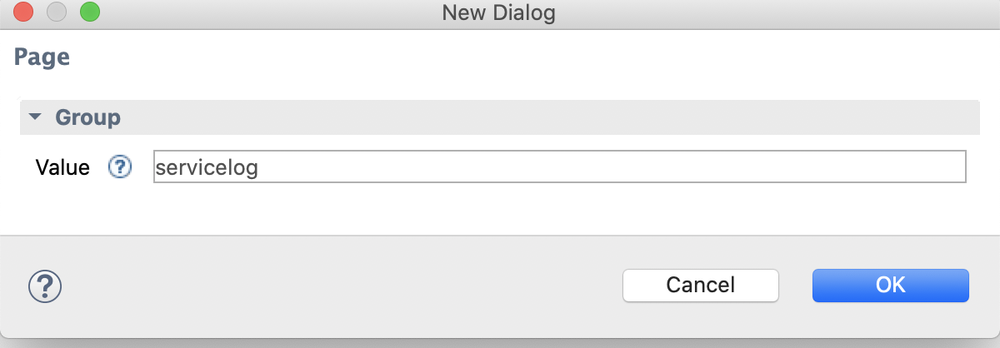
   

Map Item Dialog

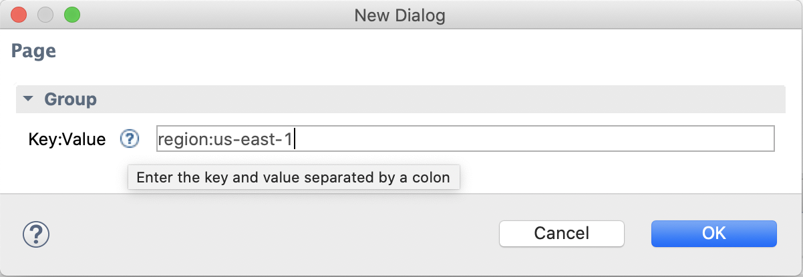
   

# Using References

There are 3 ways that you can access other objects and classes in **Direct variable access** , **Access a method of a variable** and **Invoke a static method on ca class**

## Direct variable access

Every AWS Service instance has a ```varName``` property. This is the reference to the service which can be used in other AWS Services where the service instance needs to be referenced. For example; if there is a instance of *Environment* object **mainStackEnv** is being reference by *Stack* instance **mainStack** 

Environment Properties:
    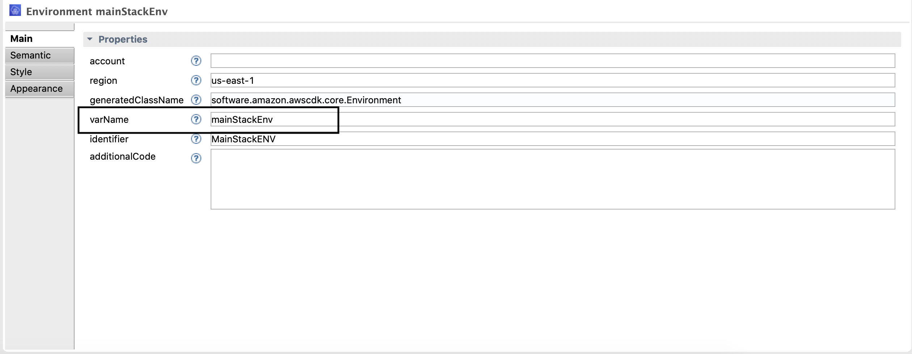

Stack Properties: 
    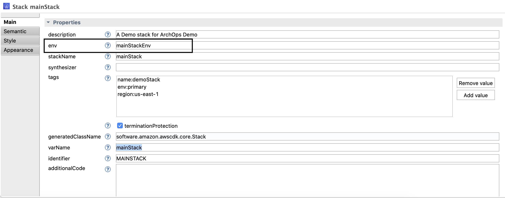

The generated code would be 

```java

        mainStackEnv = (new software.amazon.awscdk.core.Environment.Builder()).region("us-east-1").build();

		java.util.Map<java.lang.String, java.lang.String> mainStack_tags = new java.util.HashMap<java.lang.String, java.lang.String>();

		mainStack_tags.put("name", "demoStack");
		mainStack_tags.put("env", "primary");
		mainStack_tags.put("region", "us-east-1");

		mainStack = software.amazon.awscdk.core.Stack.Builder.create(app1, "MAINSTACK")
				.description("A Demo stack for ArchOps Demo").env(mainStackEnv).stackName("mainStack")
				.tags(mainStack_tags).terminationProtection(true).build();
```
## Access an instance method of a variable (surround by ~ )

At times you would need to access a method of a service instance. For example [Subnet Builder](https://docs.aws.amazon.com/cdk/api/latest/java/software/amazon/awscdk/services/ec2/Subnet.Builder.html) needs access to ```vpcId``` which can be accessed thru [getVpcId()](https://docs.aws.amazon.com/cdk/api/latest/java/software/amazon/awscdk/services/ec2/Vpc.html#getVpcId--) method of [Vpc](https://docs.aws.amazon.com/cdk/api/latest/java/software/amazon/awscdk/services/ec2/Vpc.html) service. 

To reference this method of a variable in a property, we can surround the expression with ```~```. See example below. 

**VPC Properties**

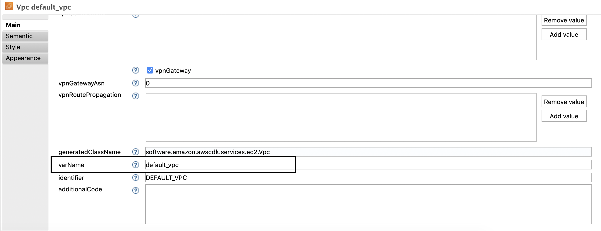

**Subnet Properties**

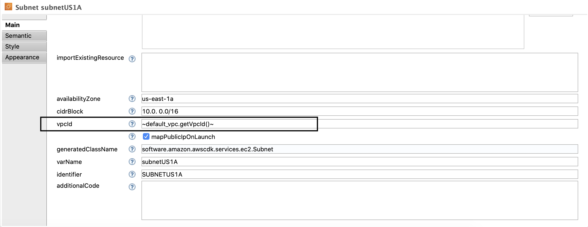

The generated code would be 

```java

default_vpc = software.amazon.awscdk.services.ec2.Vpc.Builder.create(mainStack, "DEFAULT_VPC")
				.cidr("10.0. 0.0/16").enableDnsHostnames(true).enableDnsSupport(true).maxAzs(2).natGateways(1)
				.vpnGateway(true).build();

subnetUS1A = software.amazon.awscdk.services.ec2.Subnet.Builder.create(mainStack, "SUBNETUS1A")
				.availabilityZone("us-east-1a").cidrBlock("10.0. 0.0/16").vpcId(default_vpc.getVpcId())
				.mapPublicIpOnLaunch(true).build();

```


## Access a static method of a class (surround by - )

Similar to accessing a method of a service instance, you may also be required to access the static methods of a class. For example; The [instanceType](https://docs.aws.amazon.com/cdk/api/latest/java/software/amazon/awscdk/services/autoscaling/AutoScalingGroup.Builder.html#instanceType-software.amazon.awscdk.services.ec2.InstanceType-) method of [AutoScalingGroup Builder](https://docs.aws.amazon.com/cdk/api/latest/java/software/amazon/awscdk/services/autoscaling/AutoScalingGroup.Builder.html) needs to access the static method [of()](https://docs.aws.amazon.com/cdk/api/latest/java/software/amazon/awscdk/services/ec2/InstanceType.html#of-software.amazon.awscdk.services.ec2.InstanceClass-software.amazon.awscdk.services.ec2.InstanceSize-) of [InstanceType](https://docs.aws.amazon.com/cdk/api/latest/java/software/amazon/awscdk/services/ec2/InstanceType.html). 

This can be acheived by surrounding the expressing with a ```-```. See example below. 

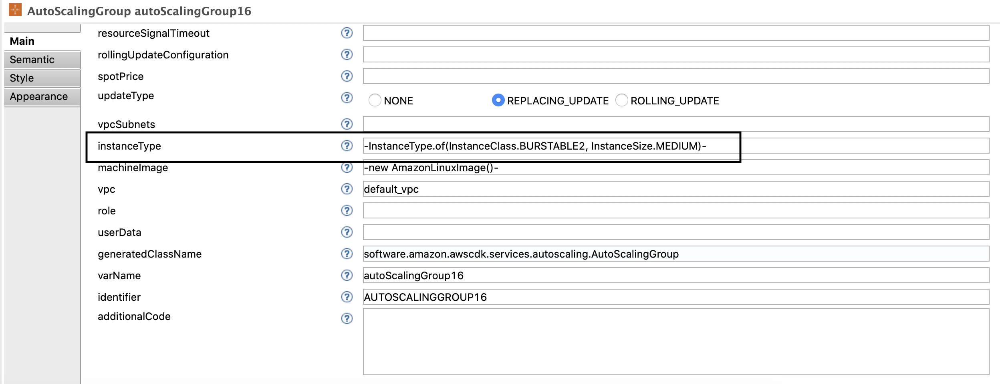

The generated code would be 

```java

autoScalingGroup16 = software.amazon.awscdk.services.autoscaling.AutoScalingGroup.Builder
				.create(mainStack, "AUTOSCALINGGROUP16").allowAllOutbound(true).maxCapacity(2)
				.replacingUpdateMinSuccessfulInstancesPercent(20).resourceSignalCount(4)
				.instanceType(InstanceType.of(InstanceClass.BURSTABLE2, InstanceSize.MEDIUM))
				.machineImage(new AmazonLinuxImage()).vpc(default_vpc).build();

```

## About importExistingResource 

All AWS Service Components have a property called ```importExistingResource``` . This property is used to import existing resource. For example [fromLookup()](https://docs.aws.amazon.com/cdk/api/latest/java/software/amazon/awscdk/services/ec2/Vpc.html#fromLookup-software.constructs.Construct-java.lang.String-software.amazon.awscdk.services.ec2.VpcLookupOptions-) method in [VPC](https://docs.aws.amazon.com/cdk/api/latest/java/software/amazon/awscdk/services/ec2/Vpc.html). More information on importing existing resource is described [here](https://garbe.io/blog/2019/09/20/hey-cdk-how-to-use-existing-resources/).

## About additionalCode

This property is not used for now. Values in this field have no effect on the generated code. 

## A note on cyclic dependencies

AWS Workbench determines the order of service creation using [topological sorting](https://en.wikipedia.org/wiki/Topological_sorting). The code generator would throw an error if it detects a cycle of dependencies. eg: A VPC referencing a Subnet and a Subnet referencing the VPC. In such cases, use reference in those services which are dependent on the other (Reference in Subnet instead of VPC) .  


