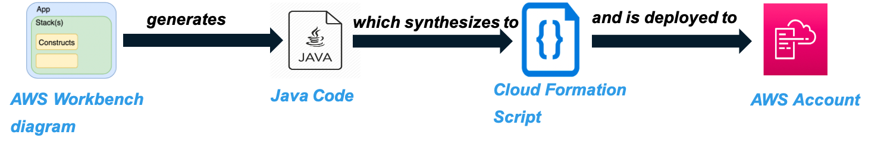
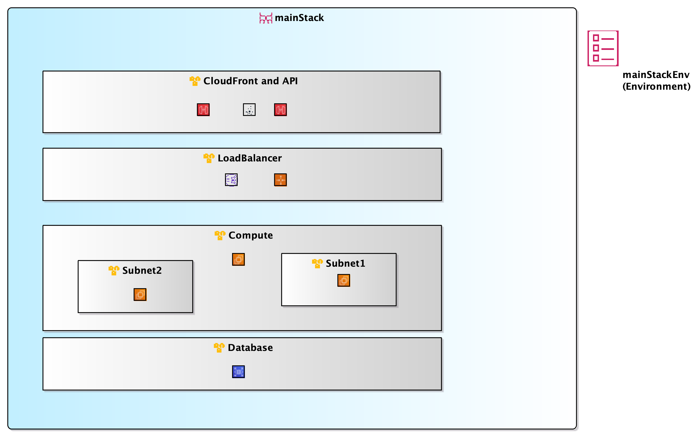
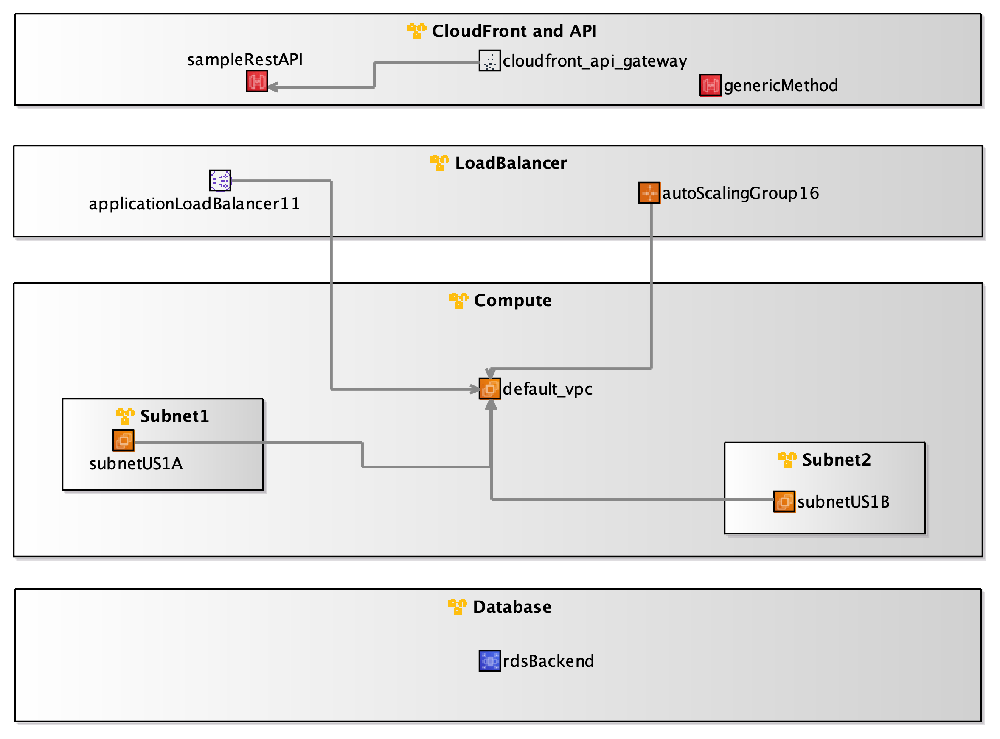
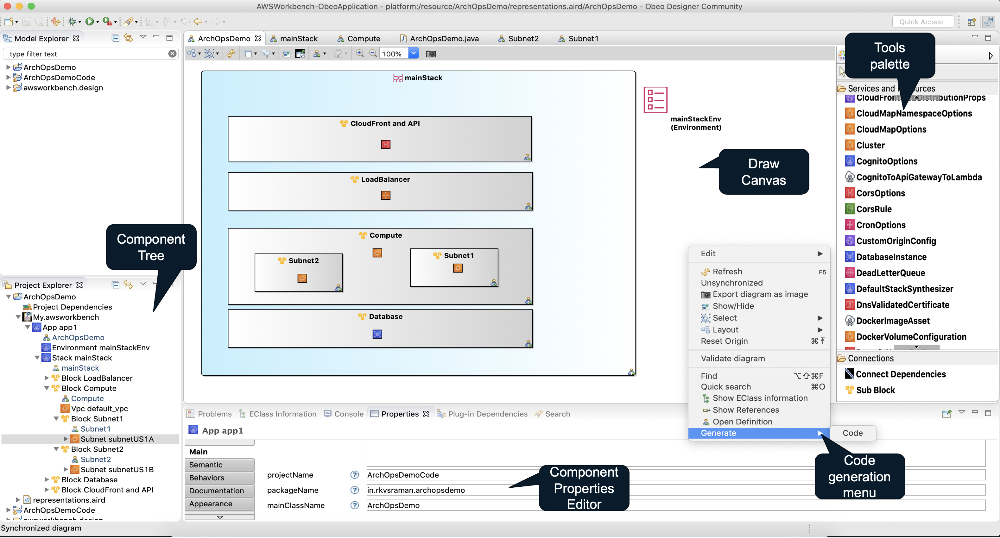
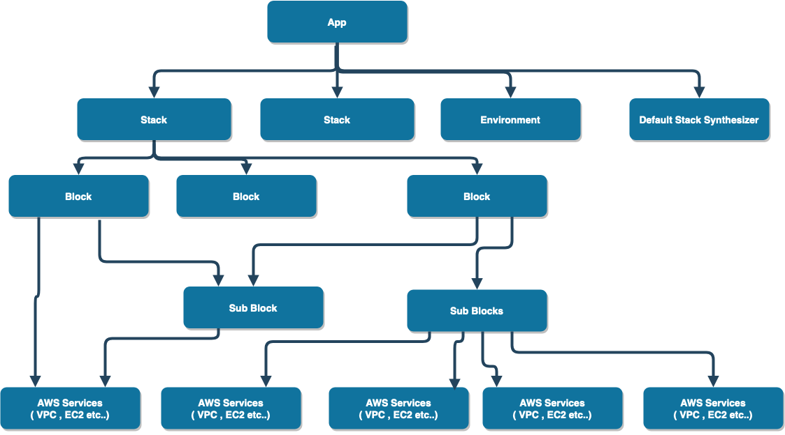

# Understanding AWS Workbench 

AWS Workbench is based on [AWS CDK](https://aws.amazon.com/cdk/) and [Eclipse Sirius](https://www.eclipse.org/sirius/). The workbench offers an Eclipse based [IDE](https://en.wikipedia.org/wiki/Integrated_development_environment) for designing and deploying AWS Services. 


 The workbench makes it easy for AWS Solution Architects and Engineers to define the AWS infrastructure using a simple Visual UI. Each service can be further configured using [properties editor](./properties-editor.md). 

## The AWS Workbench workflow



1. The user (an AWS architect) [creates a workbench project](./getting-started.md) and defines the infrastructure using the AWS services visually using a drag and drop interface. 

**Main App Tab**
 
The diagram has an heirarchy as ```App -> Stack -> Block -> Sub Block -> AWS Service Components```. User may also define ```AWS Service Component``` directly under ```Block``` . 


**Stack Tab**
 
The ```Stack``` and ```Block``` structures can be opened in independent tabs and have an uncluttered view. 

  
3. Each AWS Service component can be configured using the [properties editor](./properties-editor.md). 
4. Code is generated from ```App``` Diagram Tab by ```Right Click on Canvas -> Generate -> Code``` . 
5. Workbench reads the canvas information and the configuration from the properties editor to [generate java code](./sample-code-java.md) in a separate [Maven](https://maven.apache.org) project. The generated code uses [builder pattern](https://en.wikipedia.org/wiki/Builder_pattern). So the code for an ```AWS Bucket``` definition would look like 
```java

Bucket bucket = Bucket.Builder.create(this, "MyBucket")
                           .versioned(true)
                           .encryption(BucketEncryption.KMS_MANAGED)
                           .build();


```

6. Once the code is generated, further refinements and additions to the infrastructre code by using the helper class in the ```Maven``` project. 
7. [Cloudformation script](https://aws.amazon.com/cloudformation/) is generated using ```mvn package``` and ```cdk synth``` in the generated *Maven* project.
8. [Generated cloud formation script](./sample-code-cloudformation.md)  can be deployed using ```cdk deploy```


## The User Interface

Following screenshot shows the main components of the workbench

The main components of workbench are:- 
1. The project explorer for a heirarchical view of defined services
2. Draw canvas for architectural view of the AWS services 
3. [Property editor](./properties-editor.md) used to configure each service. 
4. Tools Palette listing all the services and aws components available in the workbench. Users can drag any component and drop it into a ```Block``` or ```Sub Block``` area.  

## The Diagram components



- ```App``` is the topmost component in any project. An App contains one or more ```Stack``` , ```Enviroment``` and ```DefaultStackSynthesizer``` structures. The *Environment* and *DefaultStackSynthesizer* are used to configure the *Stack* 
- Stack consists of one or more ```Block``` structures. *Block* may contain one or more ```Sub Block``` structures. 
- *Block* and *Sub Block* contain AWS Service components.   
    